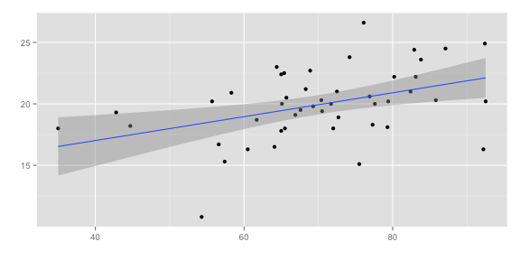

## Why Should You Know Linear Regression?

* easy to use
* easy to interpret
* applicable for a huge variety of problems
* fairly accurate

$\Rightarrow$ probably most widely used algorithm by data scientists accross the world



---

## Why Should You Know General Linear Models?

* only very few real world problems are two-dimensional
* lots of problems with discrete outcomes
* error models have to stay interpretable even when the outcome has to be positive


```
## 
## Call:  glm(formula = Infant.Mortality ~ Fertility + Education + Catholic, 
##     data = swiss)
## 
## Coefficients:
## (Intercept)    Fertility    Education     Catholic  
##     7.86737      0.15963      0.10340     -0.00625  
## 
## Degrees of Freedom: 46 Total (i.e. Null);  43 Residual
## Null Deviance:	    390 
## Residual Deviance: 298 	AIC: 230
```

---

## How Does The App Help You Understand GLM's?

---

## How Does The App Help You Explain GLM's?
